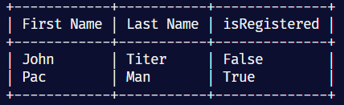

# Python-Tables

## A simple command line table generator for Python using built-in functions

---

### Usage

**Input:** (List of list , column names)

**Output:** Table generated using data in input.

---

### Input Format

Both inputs should only consist of strings.

1. **List of list:** The inner (nested) list contains the values for a single entry. The outer list contains each entry (list) in the table.
2. **Column Names:** List of column names. Should have the same length as the inner list in argument 1.

---

### Example

#### Input

```python
entries = [
    [
        'John',
        'Titer',
        'False'
    ],
    [
        'Pac',
        'Man',
        'True'
    ]
]

cols = [
'First Name',
'Last Name',
'isRegistered'
]

print_table(entries, cols)

```

#### Output


